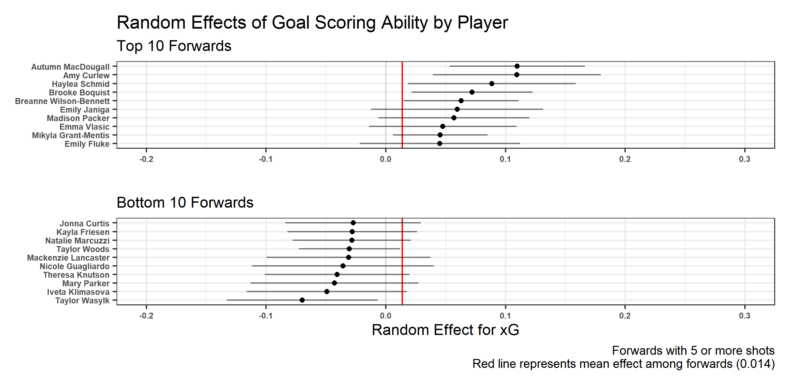
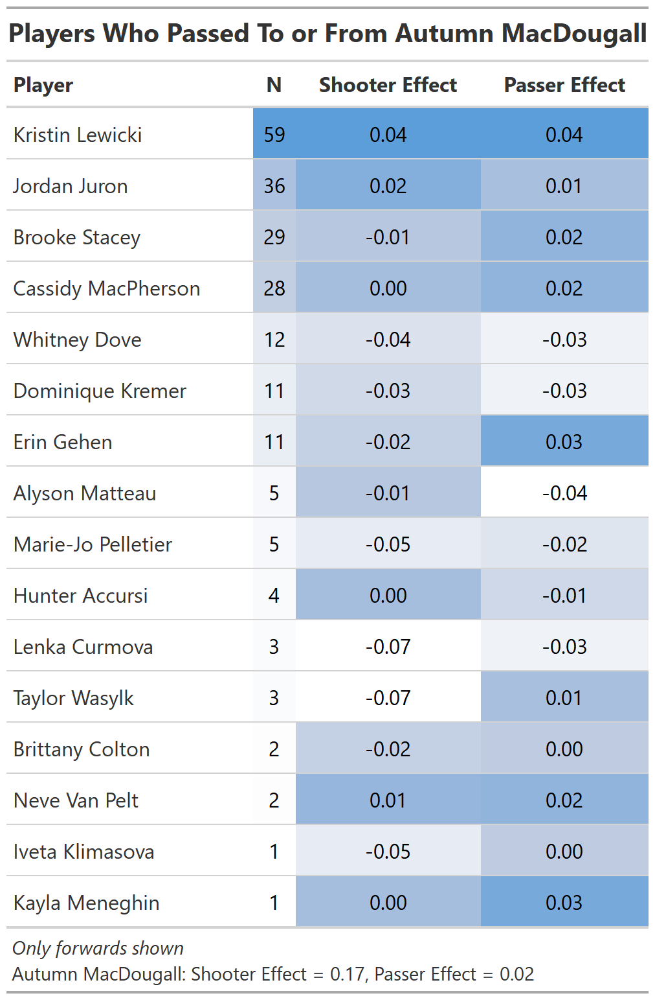

# 1. Introduction

     Since the most basic of statistics such as goals became available, player evaluation has always been a priority for both coaches and fans. Thanks to Stathletes and other companies who have created similar initiatives to distribute higher-fidelity sports data, we can now be more specific with the aspect of the game we want to analyze or quantify, with the hopes of developing more valuable ways of understanding the game. When evaluating players, instead of looking at rudimentary metrics like their total goals scored we can now look at three main aspects of the game that can be attributed to their success: **opportunity**, **luck**, and **skill**. When trying to develop sports statistics in general, each must be evaluated, yet all three present their own challenges and use cases.\
     The third aspect of game-play, *skill,* is what I will attempt to quantify in this paper. In hockey, talented players are often called "goal-scorers" and "play-makers". Metrics such as expected goals, or *xG,* have been adopted recently as ways to evaluate players that generate the most goal-scoring *value.* Just looking at raw goals or assists can be misleading since many goals can be attributed to **luck**. Where *xG* shines is by adjusting for luck by removing the actual outcome from a play and describing the quality of the play. However, much of the variance in *xG* in continuous sports like hockey and soccer can be attributed pre-shot factors. Things fare worse for assessing "play-makers" as it generally comes (from a fan's perspective) as a matter of feel or which players make flashy stick-handling moves.\
     What I will describe in this paper, is an attempt at evaluating the shooting **skill** of each player in taking high-quality or "dangerous" shot attempts as well the ability of players to make passes that lead to high quality scoring chances. I will first build an expected goals (*xG)* model for all shots in the 2020-2021 NWHL season. I will then use Generalized Linear Mixed Models to evaluate player effects relative to *xG* and to evaluate player effects with respect to future *xG* as a result of their passes.

# 2. Data

     The data used for this analysis is from the [Stathletes Big Data Cup 2021](https://www.stathletes.com/big-data-cup/ "Stathletes Big Data Bowl 2021"), hockey analytics competition. The data includes detail on events such as passes, shots, penalties, as well as X and Y coordinates for each event, player info, time stamps, and more. The details of the feature engineering and data preparation for each aspect of this analysis will be explained in their respective sections.

# 3. xG Model

     For the *xG* model, I selected all events that were either a shot or a goal. The variables are any events or situational factors prior to or at the time of the shot that could affect the probability of scoring a goal. I extracted the following features:

-   `Period`: values of 1, 2, 3 (4 for overtime) for current Period in the game.
-   `Seconds Remaining in Period`
-   `X.Coordinate`, `x_prev`, `x_prev2`: X coordinate (ice length) for shot (current, previous, and 2 events prior)
-   `Y.Coordinate`, `y_prev`, `y_prev2`: Y coordinate (ice width) for shot (current, previous, and 2 events prior)
-   `Detail`.4: One-timer (True or False)
-   `side`, `side_prev`, `side_prev2`: Home or Away (current, previous, and 2 events prior)
-   `skater_adv`: Total skater advantage for shooting team
-   `differential`: Score differential for shooting team
-   `shot_angle`: angle of shot from center of goal
-   `shot_dist`: euclidean distance to center of goal
-   `shots_period_cumsum`: cumulative sum of shots for the shooting team in the current period\

     I used a Random Forest model to predict the probability of a goal occurring on each shot using a 70/30 train-test split. Building an *xG* model is difficult in general due to the rarity of goals. The data for this analysis was particularly challenging to work with since there were only 76 goals out of 1985 recorded shots. The challenge with highly imbalanced data is that the model will default to picking the majority class since it will be, in this case, 96% accurate. In order to account for this, I used down-sampling within the `randomForest()` function in R using the `sampsize` argument. I also changed the cutoff to 65/35 instead of the default 50/50 which helped with test accuracy and log-loss. The baseline log-loss which I have defined as the log-loss if we used the mean number of goals as our prediction, was 1.63. The random forest log-loss was 0.845. The model correctly predicted 43 out of 54 goals in the training split and 19 out of the 22 goals in the test split. The most important features were the shot distance from the goal and the location of the shot.

# 4. Goal Scoring Effects

     It is generally understood and mostly intuitive that the more shots or scoring chances you generate, the more likely you are to score. McKenna Brand led the NWHL in 2020-21 with 58 shots, one of only two players with more than 50 shots, and 12 more shots than Taylor Woods in third place (Table 1). However, despite so many shots, she only managed to score 3 goals. While that puts her tied for third in the league with 3 goals, it seems as though she is under-performing expectations relative to the number of shots she has taken, and what others accomplished with less effort. While it is potentially unfair to be critical of a player's performance with such a small sample size, especially in a sport that often relies on lucky bounces, the table below demonstrates the point that shot and goal totals are not always accurate depictions of player ability.\
     In order to determine differences between players in terms of the average quality of their scoring chances, I used a layered approach. I first determined an *xG* value for each shot as described above. I then used the predicted *xG* values as the response in an implementation of Generalized Linear Mixed Models. A typical GLMM would have fixed effects that account for variance in *xG*, and random effects for players. In this case, I used a Random Forest to account for variance in *xG*, and fed those values into a GLMM*.* In the GLMM, I included random effect parameters for the shooting player. Random effects allow for differences in the intercept for the regression line in each level of the specified category, in this case, players.\
     **Skill**, is something that is often considered "intangible" and often something that can only be measured with precise biometric data. By taking into account all opportunistic and situation-based factors that result in goal probability, we can find these random intercepts that are essentially the estimated effect on goal probability that can be attributed to which player is shooting, which we will call **skill**.\
     In order to account for teammate strength, I included an additional random effect parameter for the player who passed the puck on the event immediately preceding the shot. Lastly, I included a fixed effect for whether the shot came immediately after a pass, and to account for playing style, fixed effects for the type of shot and if the shot was through traffic. The model is defined as:

\boldmath$$
\eta = X\beta + Zb
$$ where $\eta$ is the response variable (*xG* in this case), $X$ is a matrix of covariates, $\beta$ is a vector of parameters (fixed-effects), $Z$ is the random effect design matrix, and $b$ is the vector of random effect parameters.\

| Player                 | Goals | Player                  | Shots |
|:-----------------------|-------|-------------------------|------:|
| Mikyla Grant-Mentis    | 5     | McKenna Brand           |    58 |
| Samantha Davis         | 4     | Mikyla Grant-Mentis     |    54 |
| Taylor Woods           | 4     | Taylor Woods            |    46 |
| Autumn MacDougall      | 3     | Lauren Kelly            |    44 |
| Jillian Dempsey        | 3     | Sarah-Eve Coutu Godbout |    43 |
| Mallory Souliotis      | 3     | Christina Putigna       |    39 |
| McKenna Brand          | 3     | Taylor Turnquist        |    39 |
| Audra Richards         | 2     | Samantha Davis          |    38 |
| Breanne Wilson-Bennett | 2     | Lindsay Eastwood        |    37 |
| Brooke Boquist         | 2     | Taylor Wenczkowski      |    37 |

: Top 10 players in shots and goals. McKenna Brand leads the NWHL in shots but is 7th in goals.

     Figure 1 shows that Autumn MacDougall has the 2^nd^ highest estimated probability of scoring per shot attempt. As shown in Table 1, she is tied for third in the number of goals yet she does not appear in the top 10 in terms of shots. In fact, she only had 21 shots, less than half the total shots of McKenna Brand. Furthermore, not only does Brand not appear in the top 10 in Figure 2, she is 52^nd^ out of 71 forwards in the random effects model. While one could say that Autumn MacDougall benefited from a few lucky bounces, these model results suggest that her goals are more like a result of her shooting skill, which is best defined as her ability to be in the right location at the right time. Taylor Woods is another player that fits the McKenna Brand profile. She is third in the league in shots at 46 and tied for second in the league in goals with four. However, she has the 8^th^ *worst* random intercept of all forwards in the model at -0.03, meaning she contributes to an estimated 3% less chance of a goal on average on shots that she takes, adjusted for pre-shot factors and teammate strength.\
     The random intercepts for each player correlate with *xG* on each shot moderately, with an R^2^ of 0.14, which shows that a player's shooting skill accounts for a moderate amount of variance in the quality of their scoring chances. If we adjust the *xG* values on each shot for player skill (see Section 6 for an explanation on the adjustment), the R^2^ goes down to 0.03. This gives some evidence to the reliability of these random effects.

{width="600"}

# 5. xG Model for Passes

     In this section I will describe the method used for predicting the future *xG* that results from a pass. I built a random forest model similar to above, but with slightly different features. The output for this model was the total *xG* in the next 10 seconds (10 seconds was chosen arbitrarily). The *xG* values for each shot were adjusted for the skill of the shooter by subtracting the intercept value from the GLMM in Section 4. Because I built the GLMM assuming *xG* has a gaussian distribution, the intercept values can be interpreted literally and subtracted from the *xG* of a shot in order to remove the effect of the shooter. The model includes all complete or incomplete pass attempts.\
     As a side note, there have been many attempts at evaluating future *xG* or future effects of all game events. My goal for this model was not to evaluate the value of every play and create a "total-value" statistic. The point is to look at the short-term, or immediate effects, of passes on *xG*.\
     The features for this model are:

-   `Period`: values of 1, 2, 3 (4 for overtime) for current Period in the game.
-   `Seconds Remaining in Period`
-   `X.Coordinate`, `x_prev`, `x_prev2`: X coordinate (ice length) for pass (current, previous, and 2 events prior)
-   `Y.Coordinate`, `y_prev`, `y_prev2`: Y coordinate (ice width) for pass (current, previous, and 2 events prior)
-   `X.Coordinate.2`, `Y.Coordinate.2` - X and Y coordinate of pass target location
-   `Detail.1`: Pass detail (Direct or Indirect)
-   `side`, `side_prev`, `side_prev2`: Home or Away (current, previous, and 2 events prior)
-   `skater_adv`: Total skater advantage for event team
-   `differential`: Score differential for event team
-   `time_since_last_shot:` Seconds since last shot for passing team
-   `shots_period_cumsum`: cumulative sum of shots for the shooting team in the current period
-   `xG_prev_10s`: total team xG in previous 10 seconds, adjusted for teammate shooting skill

The model had an RMSE of .209 compared to .231 for the naive prediction (mean *xG* in next 10 seconds for all passes). The most important features were the location variables, specifically the previous and current location along the length of the ice. This is reasonable since passes closer to offensive zone and goal will likely lead to more shots.

# 6. Play Making Effects

     In order to determine individual effects of passing ability, I used a similar method as in Section 4. I used the output from the model in Section 5 as the response in a random effects model. The model definition is similar to that of the GLMM in Section 4, but in this instance I did not include any fixed effects. Figure 2 shows the random intercepts for players' predicted *xG* 10 seconds after a pass. Some notable names near the top are McKenna Brand, whose play-making ability may back up her lower shooting ability, Mikayla Grant-Mentis, the league leader in goals, and Jillian Dempsey.

{width="600"}

# 7. Discussion

## 7.1 Applications

     As I mentioned above, the goal of this research is not necessarily to create a leader-board or generate a new statistic. While those may be possibilities with the outcomes of the models above and are exciting for fans, what this research aims to do is to provide additional insight to offensive abilities of players with the eventual goal of optimizing rosters or lines. For example, Autumn MacDougall sits tied for third in goals, yet only has 21 shots. From a strategy perspective, Autumn MacDougall may be suffering from a lack of support. More research would be needed to determine the cause of her lower (technically average) shot volume, but the point remains that the coaching staff would likely want to find ways to increase her number of shooting opportunities. The same idea could apply to players like McKenna Brand. She shoots often, and does score, but she is near the top of our "play-makers" model. Perhaps the Boston Pride would improve the quality of their scoring chances by creating a game strategy using her as a play-maker rather than a shooter, or putting a highly skilled shooter on her line.\
     For the sake of demonstration, Figure 3 shows all the forwards that had at least one pass to or from Autumn MacDougall. It looks like she is generally grouped with Kristin Lewicki, with some combination of Jordan Juron, Brooke Stacey, and Cassidy MacPherson. Those four players all have high passer effects and high shooter effects. However, the Beauts lost 5 of their 6 games in 2021, and did not score more than 2 goals in any game. For a team that needs more offensive production, perhaps a good place to start playing with their line groupings would be to move Erin Gehen up to give support to MacDougall and Lewicki since her passer effect is higher than Juron and McPherson, yet only has 7 passing interactions with MacDougall. Juron also has a high shooter effect and could use additional passing support to get more shooting opportunities.

## 7.2 Limitations

     There is still room for improvement and further research. First, the significance of the random effects may be limited by the small sample size. Some players have only recorded a handful of shots and have wide confidence intervals. It is possible that with more data we may be able to get more specific estimates of player effects.\
     Another aspect that could be improved is the model for future *xG* used in determining passing ability. It is technically better than the naive model, but not by much, suggesting that there is still much variability in *xG* resulting from passes that can be explained. There is also an opportunity to use better modeling techniques such as gradient boosting, as well as different methods of determining future *xG* using something like [*VAEP*](https://arxiv.org/pdf/1802.07127.pdf) or [*xT*](https://karun.in/blog/expected-threat.html#:~:text=Expected%20Threat%20(xT)%20%3D%200.094,actions%209.4%25%20of%20the%20time.)*.* It is also difficult to adjust for teammate strength since we do not have the locations of all players on every event. Lastly, there is opportunity for research regarding the ideal combinations of player effects, since just having those effect values do not tell a coach what choices to make. They are, however, a great starting point.

# 8. Conclusion

     Quantifying player skill is difficult in any sport. What makes hockey a particular challenge is the continuous nature of game-play and the reliance each player has on teammates to set them up for quality scoring chances. With this research, I have created a framework for separating individual player effects from other factors that influence *xG*. With these player effects, we can evaluate line groupings and be more strategic about putting players in positions to succeed.\
     Thanks to all those at Stathletes for putting together this competition, and specifically Meghan Chayka, for her hard work in making the competition a success. Also, thanks to Domenic Galamini and Josh Pohlkamp-Hartt for their time spent guiding me through this project.

The code is available on GitHub: <https://github.com/dtreisman/BigDataCup2021>\
\
**Contact me:**\
[Twitter](https://twitter.com/DaniTreisman)\
[Github](https://dtreisman.github.io/Portfolio)\
[LinkedIn](https://www.linkedin.com/in/dani-treisman/)

{width="186"}
